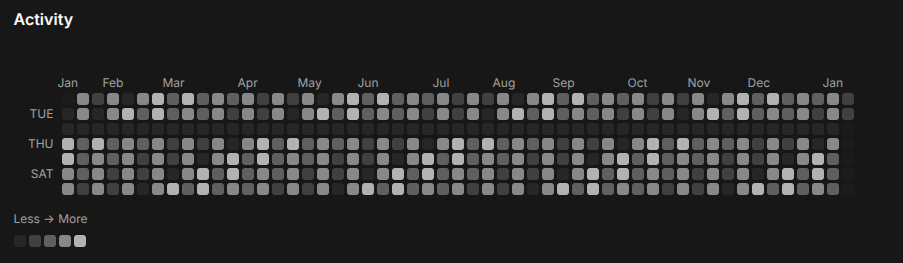

# React Heatmap Calendar (shadcn/ui)

A **GitHub-style heatmap calendar** component built with **React**, **Tailwind CSS**, and **shadcn/ui**.

✔️ Copy-paste friendly
✔️ No charting libraries
✔️ Light & dark mode
✔️ Axis labels (months + weekdays)
✔️ Domain-agnostic (fitness, business, IoT, learning, etc.)

---

## ✨ Features

- 📅 **Calendar heatmap** (GitHub-style)
- 🧭 **Axis labels**
  - Months on top
  - Weekdays on the left
- 🎨 **Theme presets** with copyable CSS variables
- 🌗 **Light / dark mode ready**
- 🧩 **Domain-agnostic**
  - fitness activity
  - business metrics
  - support tickets
  - learning progress
  - IoT events
- 🧠 **Smart data merging** (duplicate dates are summed)
- 🧪 Tooltips & click handlers
- ⚡ No canvas, SVG, or heavy chart libraries

---

## 📸 Preview



Live demo available in the repository / website.

---

## 🚀 Installation

This component is designed to be **copied directly** into your project (like shadcn blocks).

---

### 1️⃣ Install dependencies

```bash
npm install clsx tailwind-merge lucide-react
```

### 2️⃣ Add required shadcn/ui components

```bash
npx shadcn@latest add card tooltip
```

### 3️⃣ Copy the component files

Copy the following file into your project:

```text
components/heatmap-calendar.tsx
```

No provider.
No configuration.
No build step.

---

## 🔧 API Reference

### props

| Prop              | Type                               | Default           | Description                                    |
| ----------------- | ---------------------------------- | ----------------- | ---------------------------------------------- |
| `title`           | `string`                           | `"Activity"`      | Title displayed above the heatmap              |
| `data`            | `HeatmapDatum[]`                   | **required**      | Daily aggregated data                          |
| `rangeDays`       | `number`                           | `365`             | Number of days to render (ending at `endDate`) |
| `endDate`         | `Date`                             | `new Date()`      | Last date of the heatmap range                 |
| `weekStartsOn`    | `0 \| 1`                           | `1`               | Week start (`0` = Sunday, `1` = Monday)        |
| `cellSize`        | `number`                           | `12`              | Cell size in pixels                            |
| `cellGap`         | `number`                           | `3`               | Gap between cells in pixels                    |
| `axisLabels`      | `boolean \| AxisLabelConfig`       | `true`            | Show or configure axis labels                  |
| `legend`          | `boolean \| LegendConfig`          | `true`            | Show or configure the legend                   |
| `palette`         | `string[]`                         | —                 | Custom color palette for intensity levels      |
| `levelClassNames` | `string[]`                         | semantic defaults | Tailwind classes for intensity levels          |
| `onCellClick`     | `(cell: HeatmapCell) => void`      | —                 | Called when a cell is clicked                  |
| `renderTooltip`   | `(cell: HeatmapCell) => ReactNode` | —                 | Custom tooltip renderer                        |
| `renderLegend`    | `(args) => ReactNode`              | —                 | Fully custom legend renderer                   |
| `className`       | `string`                           | —                 | Additional class names for the card            |

### 📊 Data format

The heatmap expects daily aggregated data.

```ts
export type HeatmapDatum = {
  date: string | Date; // "YYYY-MM-DD" recommended
  value: number; // daily intensity
  meta?: unknown; // optional metadata
};
```

Example

```ts
const data = [
  { date: "2025-01-01", value: 3 },
  { date: "2025-01-02", value: 0 },
  { date: "2025-01-03", value: 8 },
];
```

Notes

- Duplicate dates are automatically merged (values are summed)
- Use "YYYY-MM-DD" strings to avoid timezone issues
- Values can represent anything: minutes, orders, tickets, events, etc.

---

### 🧩 Basic usage

```ts
import { HeatmapCalendar } from "@/components/heatmap-calendar"

export default function Example() {
  return (
    <HeatmapCalendar
      title="Activity"
      data={data}
      axisLabels
    />
  )
}
```

### 🧭 Axis labels (months + weekdays)

Axis labels are enabled by default and show:

- 📅 Months on top
- 📆 Weekdays on the left

```ts
<HeatmapCalendar data={data} axisLabels />
```

Customize axis labels

```ts
<HeatmapCalendar
  data={data}
  axisLabels={{
    showMonths: true,
    showWeekdays: true,
    weekdayIndices: [1, 3, 5], // Mon / Wed / Fri
    monthFormat: "short",      // "short" | "long" | "numeric"
    minWeekSpacing: 3,
  }}
/>
```

Disable completely:

```ts
<HeatmapCalendar data={data} axisLabels={false} />
```

### 🖱️ Tooltips & interaction

```ts
<HeatmapCalendar
  data={data}
  onCellClick={(cell) => {
    console.log(cell.date, cell.value, cell.meta)
  }}
  renderTooltip={(cell) => (
    <div>
      <div className="font-medium">{cell.value} events</div>
      <div className="text-muted-foreground">{cell.label}</div>
    </div>
  )}
/>
```

---

### 🤝 Contributing

Contributions are welcome!

- Bug fixes
- Performance improvements
- Documentation improvements
- New examples

Feel free to open an issue or pull request.

---

### 📄 License

MIT © Minh (Marcus) Nguyen

---

Made with ❤️ by Minh (Marcus) Nguyen
